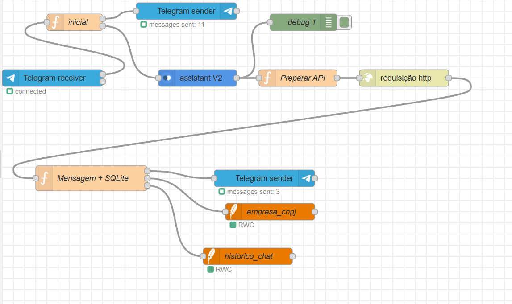
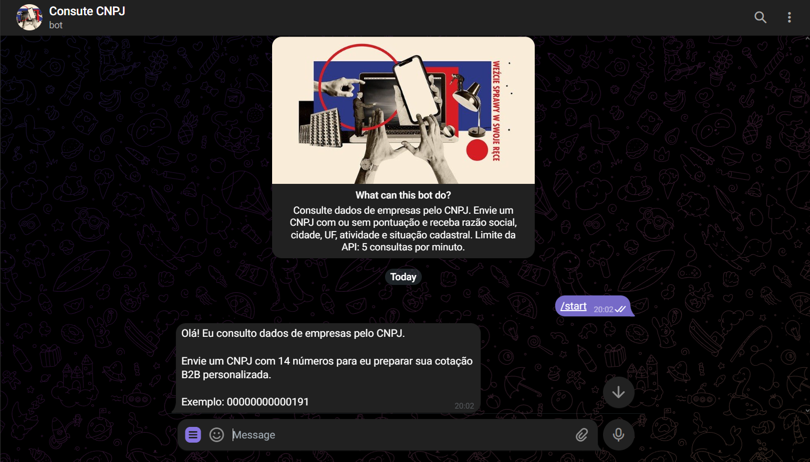

<p align="center">
  
</p>

<p align="center"> 
  Bot no Telegram para consulta de dados públicos de empresas brasileiras utilizando CNPJ.
  O projeto foi desenvolvido utilizando Node-RED, Telegram Bot, IBM Watson/watsonx Assistant, SQLite e a API pública CNPJa.
</p> 

---

# 📌 Funcionalidades

- Recebe mensagens pelo Telegram
- Responde ao comando `/start`
- Reconhece saudações como:
  - oi
  - olá
  - hello
- Solicita um CNPJ ao usuário
- Aceita CNPJ:
  - com pontuação
  - sem pontuação
- Valida CNPJ com 14 dígitos
- Consulta dados da empresa via API pública CNPJa
- Retorna:
  - Razão social
  - Cidade
  - Estado
  - Atividade principal
  - Situação cadastral
- Permite múltiplas consultas sem encerrar o chat
- Salva consultas em banco SQLite
- Salva histórico da conversa
- Possui tratamento de mensagens inválidas (fallback)

---

# 🛠️ Tecnologias Utilizadas

- Node-RED
- Telegram Bot
- IBM Watson / watsonx Assistant
- SQLite
- API pública CNPJa

---

# 📂 Estrutura do Projeto

```bash
chatbot-consulta-cnpj/
│
├── README.md
│
├── flows/
│   └── flows.json
│
├── database/
│   ├── Empresas_B2B.db
│   └── historico_chat.db
│
├── assets/
│   └── funcionamento.mp4
│
└── docs/
    └── imagens/
```
# 📷 Imagens do Projeto

## Fluxo no Node-RED



## Conversa no Telegram



---

# ⚙️ Como Executar o Projeto

## 1. Abrir o Node-RED

Inicie o Node-RED normalmente em sua máquina.

---

## 2. Importar o fluxo

Importe o arquivo:

```bash
flows/flows.json
```

---

## 3. Configurar o Telegram Bot

Abra o nó do Telegram dentro do Node-RED e configure:

- Token do Bot
- Credenciais do Telegram

Bot utilizado no projeto:

```txt
@nodered_empresas_cnpj_bot
```

---

# 4. Configurar o Watson Assistant

Abra os nós do IBM Watson / watsonx Assistant e configure:

- API Key
- URL
- Assistant ID

---

# 5. Configurar os bancos SQLite

Abra os nós SQLite no fluxo e altere os caminhos dos bancos:

## Banco de empresas

```bash
database/Empresas_B2B.db
```

## Banco de histórico

```bash
database/historico_chat.db
```

---

# 6. Instalar dependências do Node-RED

Instale os seguintes pacotes:

```bash
node-red-contrib-telegrambot
node-red-node-watson
node-red-node-sqlite
```

---

# 7. Fazer Deploy

Após configurar tudo:

```txt
Deploy → Full Deploy
```

---

# 8. Testar o Bot

No Telegram:

```txt
/start
```

---

# 💬 Exemplo de Uso

## Usuário

```txt
/start
```

## Bot

```txt
Olá! Eu consulto dados de empresas pelo CNPJ.

Envie um CNPJ com 14 números para eu preparar sua cotação B2B personalizada.

Exemplo:
00000000000191
```

---

## Usuário

```txt
07526557011659
```

## Bot

```txt
Olá equipe da AMBEV S.A.!

Identifiquei o CNPJ 07526557011659.
Vi que vocês são de Manaus-AM e atuam com Fabricação de cervejas e chopes.

Sua cotação B2B personalizada foi liberada com sucesso.

Deseja consultar outro CNPJ?
Responda Sim ou Não.
```

---

# ✅ Formatos Aceitos

```txt
00000000000191
00.000.000/0001-91
```

---

# 🧪 CNPJs para Teste

```txt
00000000000191
00.000.000/0001-91
07526557011659
```

---

# 🌐 API Utilizada

API pública:

```txt
https://open.cnpja.com/office/CNPJ
```

Exemplo:

```txt
https://open.cnpja.com/office/00000000000191
```

---

# ⚠️ Limite da API

A API pública CNPJa possui limite de:

```txt
5 consultas por minuto por IP
```

Caso o limite seja excedido:

- aguarde aproximadamente 1 minuto
- realize uma nova consulta

---

# 🗄️ Bancos SQLite

## Empresas_B2B.db

Armazena:

- CNPJ
- Razão Social
- Cidade
- Estado
- Atividade
- Situação

---

## historico_chat.db

Armazena:

- ChatID
- CNPJ
- Resposta_Bot

---

# 🎥 Demonstração

O vídeo abaixo mostra:

- interação pelo Telegram
- envio de CNPJ
- resposta personalizada
- armazenamento no banco SQLite

Arquivo:

```bash
assets/funcionamento.mp4
```

---

# 📌 Observações Importantes

Os caminhos dos bancos SQLite podem precisar ser alterados após a importação do fluxo no Node-RED.

Os arquivos `.db` já estão incluídos no projeto, porém o Node-RED deve apontar corretamente para eles no computador onde o fluxo será executado.

---

# 📄 Licença

Projeto acadêmico desenvolvido para fins educacionais.
